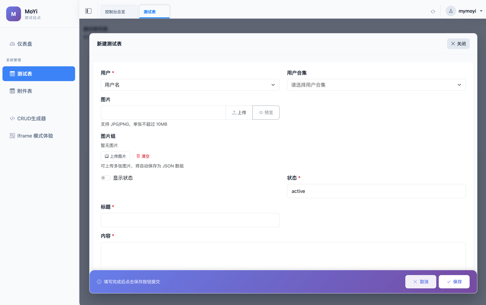
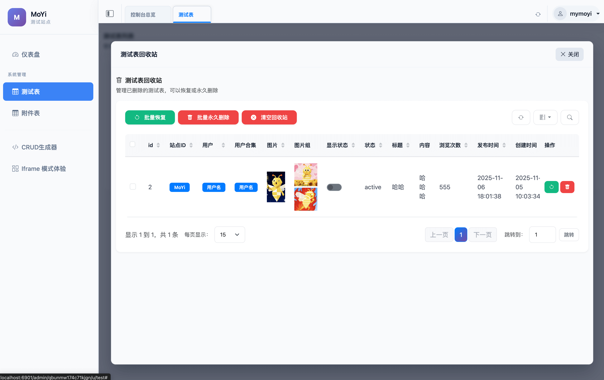
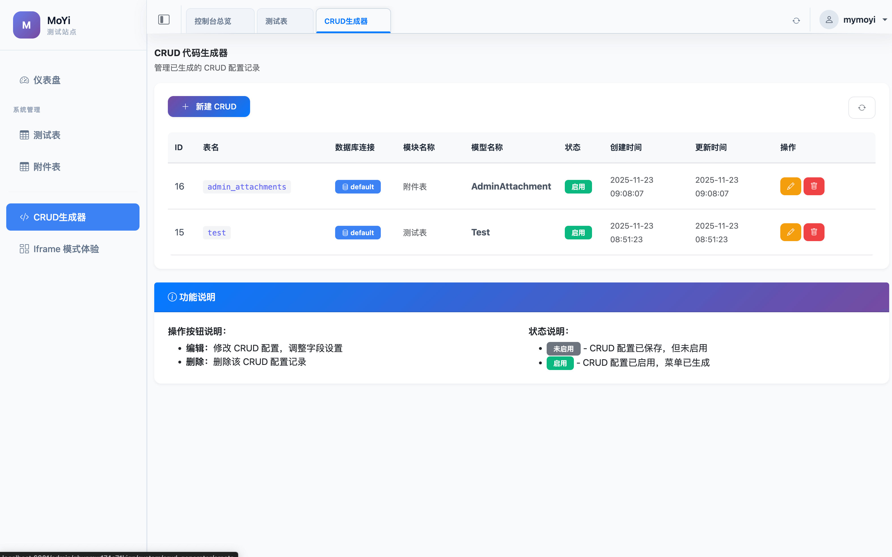
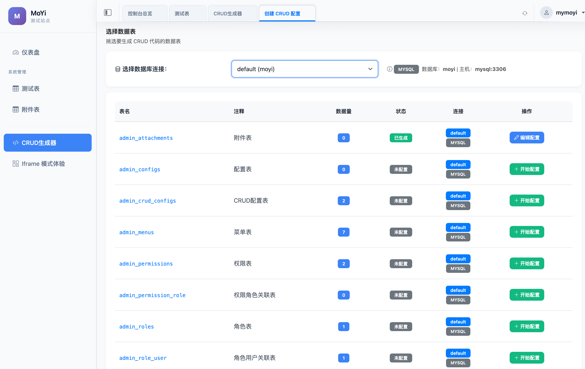

@ -1,355 +1,22 @@
# Moyi Admin - 基于 Hyperf 的后台管理系统

<div align="center">


一个基于 Hyperf 框架构建的后台管理系统，采用通用 CRUD 设计模式，大幅减少重复代码。

[功能特性](#功能特性) • [技术栈](#技术栈) • [快速开始](#快速开始)

</div>

---

## 📖 项目简介

Moyi Admin 是一个基于 Hyperf 3.1 框架开发的后台管理系统，采用通用 CRUD 设计模式，通过配置即可完成数据管理功能，无需为每个模型重复编写代码。系统支持多数据库管理，在创建 CRUD 配置和进行数据操作时，可以选择不同的数据库连接，实现跨数据库的统一管理。

> **🌟 重要说明**：本项目完全基于时下最先进的 AI 技术构造开发，从架构设计、代码实现到文档编写，全程采用 AI 辅助开发，展现了 AI 在软件开发领域的强大能力。

### 核心特性

- 🤖 **AI 驱动开发**：完全基于最先进的 AI 技术构造，展现 AI 辅助开发的无限可能
- 🚀 **高性能**：基于 Swoole 协程，支持高并发处理
- 🎯 **通用 CRUD**：一套代码管理所有数据模型，无需重复开发
- 🗄️ **多数据库支持**：在 CRUD 操作时可选择不同的数据库进行数据管理
- 🌐 **多站点支持**：支持多站点独立管理，每个站点拥有独立的数据和会话
- 🔗 **远程数据库管理**：支持添加和管理远程数据库连接，实现跨数据库统一管理
- 🖼️ **iframe 模式**：支持 iframe 嵌入模式，可在弹窗中打开页面，提升用户体验
- 🗑️ **回收站**：支持软删除、恢复、永久删除
- 📊 **数据导出**：支持 Excel/CSV 格式导出
- 🎨 **现代化 UI**：基于 Bootstrap 5 的响应式界面

---

## ✨ 功能特性

### 已完成功能

#### 1. 核心 CRUD 功能
- ✅ **数据列表**：支持分页、搜索、排序
- ✅ **数据创建**：表单验证、字段类型自动识别，支持选择不同数据库进行创建
- ✅ **数据编辑**：支持数据更新、数据回显，支持跨数据库操作
- ✅ **数据删除**：支持单个删除、批量删除
- ✅ **状态切换**：快速启用/禁用状态切换
- ✅ **字段显示控制**：支持列显示/隐藏切换
- ✅ **多数据库管理**：在 CRUD 配置和操作时可选择不同的数据库连接

#### 2. 数据导出功能
- ✅ **Excel 导出**：支持导出为 Excel 格式
- ✅ **CSV 导出**：支持导出为 CSV 格式
- ✅ **条件导出**：支持按搜索条件导出数据

#### 3. 回收站功能
- ✅ **软删除**：删除数据进入回收站，不直接删除
- ✅ **回收站管理**：查看已删除数据列表
- ✅ **数据恢复**：支持单个恢复、批量恢复
- ✅ **永久删除**：支持单个永久删除、批量永久删除
- ✅ **清空回收站**：一键清空所有已删除数据

#### 4. CRUD 配置管理
- ✅ **CRUD 配置**：可视化配置数据表的 CRUD 功能
- ✅ **字段配置**：可视化配置字段类型、验证规则、显示方式
- ✅ **功能开关**：支持搜索、新增、编辑、删除、导出等功能开关

#### 5. 多站点功能
- ✅ **站点管理**：支持创建和管理多个独立站点
- ✅ **站点隔离**：每个站点拥有独立的数据、会话和配置
- ✅ **会话隔离**：多站点会话完全隔离，互不干扰
- ✅ **站点设置**：支持自定义站点名称、域名、管理入口路径等
- ✅ **公共站点创建**：支持开启公共站点创建向导，允许外部用户自助创建站点
- ✅ **域名验证**：站点创建时自动验证域名所有权，确保安全性
- ✅ **站点验证接口**：提供 `/site/verification` 接口用于域名验证

#### 6. 数据库连接管理
- ✅ **远程数据库连接**：支持添加和管理多个远程数据库连接
- ✅ **连接测试**：创建或编辑连接时可测试连接是否正常
- ✅ **连接状态管理**：支持启用/禁用数据库连接
- ✅ **多数据库切换**：在 CRUD 操作时可选择不同的数据库连接
- ✅ **连接信息加密**：数据库密码等敏感信息安全存储

#### 7. iframe 模式支持
- ✅ **iframe 嵌入**：支持在弹窗中以 iframe 方式打开页面
- ✅ **页面通信**：iframe 内页与父页面双向通信机制
- ✅ **自动刷新**：iframe 内操作完成后自动刷新父页面
- ✅ **授权检查**：iframe 模式下自动检查授权状态
- ✅ **体验页面**：提供 iframe 模式体验页面，展示功能特性

#### 8. 系统功能
- ✅ **登录认证**：用户登录认证，支持验证码保护
- ✅ **文件上传**：支持图片、文件上传，客户端直传方案
- ✅ **仪表盘**：系统首页，展示数据统计和图表
- ✅ **系统安装**：可视化系统安装向导（自动创建数据库表）

---

## 🛠️ 技术栈

### 后端技术
- **框架**：Hyperf 3.1（基于 Swoole 协程框架）
- **语言**：PHP 8.1+
- **数据库**：MySQL 5.7+
- **缓存**：Redis
- **ORM**：Hyperf Database（类似 Eloquent）

### 前端技术
- **UI 框架**：Bootstrap 5.3
- **图标库**：Bootstrap Icons
- **模板引擎**：Blade（Hyperf View Engine）
- **JavaScript**：原生 ES6+（无框架依赖）
- **表格组件**：自定义 DataTable 组件
- **日期选择**：Flatpickr
- **下拉选择**：Tom Select

---

## 🚀 快速开始

### 环境要求

- PHP >= 8.1
- Swoole >= 5.0
- MySQL >= 5.7
- Redis >= 5.0
- Composer >= 2.0

### 安装步骤

#### 1. 克隆项目

```bash
git clone https://github.com/M0Yi/moyi-admin.git
cd moyi-admin
```

```bash
docker run -dit  --name moyi-admin -v $(pwd):/data/project -w /data/project -p 6501:6501 hyperf/hyperf:8.3-alpine-v3.19-swoole sh
```

#### 2. 安装依赖

```bash
composer install
```

#### 3. 配置环境

复制环境配置文件：

```bash
cp .env.example .env
```

编辑 `.env` 文件，配置数据库和 Redis：

```env
DB_DRIVER=mysql
DB_HOST=127.0.0.1
DB_PORT=3306
DB_DATABASE=moyi_admin
DB_USERNAME=root
DB_PASSWORD=your_password

REDIS_HOST=127.0.0.1
REDIS_PORT=6379
REDIS_DB=0
```

**🆕 多站点配置**

系统支持多站点管理，每个站点拥有独立的数据和会话。相关配置如下：

```env
# 是否允许公共站点创建（默认关闭）
ENABLE_PUBLIC_SITE_CREATION=false

# 新站点管理员的默认角色 ID（默认值为 2）
SITE_PUBLIC_DEFAULT_ROLE_ID=2

# 站点验证令牌有效期（秒，默认 300 秒）
SITE_VERIFICATION_TOKEN_TTL=300

# 是否验证 DNS（默认开启）
SITE_VERIFY_DNS=true

# 是否验证主机名格式（默认开启）
SITE_VALIDATE_HOSTNAME=true
```

**站点创建流程**：

1. 启用公共站点创建：设置 `ENABLE_PUBLIC_SITE_CREATION=true`
2. 访问站点创建向导：`http://your-domain/site/register`
3. 填写站点信息：域名、站点名称、管理员账号等
4. 域名验证：系统自动验证域名所有权（通过 `/site/verification` 接口）
5. 创建完成：自动创建站点和管理员账号

**域名验证机制**：

- 系统会向目标域名的 `/site/verification` 接口发送验证请求
- 验证接口返回加密令牌，确保域名所有权
- 支持 HTTP 和 HTTPS 两种协议自动尝试
- 验证令牌有效期可配置，默认 5 分钟

**💡 多数据库配置**：

系统支持管理多个数据库，有两种方式配置数据库连接：

**方式1：配置文件方式（静态配置）**

编辑 `config/autoload/databases.php` 文件：

```php
return [
    'default' => [
        'driver' => env('DB_DRIVER', 'mysql'),
        'host' => env('DB_HOST', '127.0.0.1'),
        'port' => env('DB_PORT', 3306),
        'database' => env('DB_DATABASE', 'moyi_admin'),
        'username' => env('DB_USERNAME', 'root'),
        'password' => env('DB_PASSWORD', ''),
        'charset' => env('DB_CHARSET', 'utf8mb4'),
        'collation' => env('DB_COLLATION', 'utf8mb4_unicode_ci'),
        // ... 其他配置
    ],
    // 添加更多数据库连接
    'database2' => [
        'driver' => 'mysql',
        'host' => '127.0.0.1',
        'port' => 3306,
        'database' => 'another_database',
        'username' => 'root',
        'password' => 'password',
        'charset' => 'utf8mb4',
        'collation' => 'utf8mb4_unicode_ci',
        // ... 其他配置
    ],
];
```

**方式2：后台管理方式（动态配置）**

1. 登录后台管理系统
2. 进入「系统管理」→「数据库连接管理」
3. 点击「新建数据库连接」
4. 填写连接信息（名称、主机、端口、数据库名、用户名、密码等）
5. 点击「测试连接」验证连接是否正常
6. 保存后即可在 CRUD 操作时选择该数据库连接

**数据库连接使用**：

- 在创建 CRUD 配置时，可以选择使用的数据库连接
- 在数据列表、创建、编辑等操作时，系统会使用配置的数据库连接
- 支持 MySQL 和 PostgreSQL 两种数据库类型
- 连接信息加密存储，确保安全性

#### 4. 启动服务

**开发环境**：

```bash
php bin/hyperf.php start
```

**使用 Docker**：

```bash
docker-compose up -d
```

> **⚠️ 重要提示**：使用 Docker 时，需要确保主机端口 6501 未被占用。如果 6501 端口已被占用，可以修改 `docker-compose.yml` 中的端口映射，例如改为 `6601:6501`（将主机 6601 映射到容器 6501），然后通过 `http://localhost:6601` 访问。

**重新编译新版本**：

如果需要重新编译 Docker 镜像（例如更新了代码或依赖），可以使用以下命令：

```bash
# 停止并删除容器和卷
docker-compose down -v

# 重新构建镜像并启动容器
docker-compose up -d --build --force-recreate
```

> **⚠️ 重要警告**：`docker-compose down -v` 命令中的 `-v` 参数会**删除所有 Docker 卷**，包括数据库数据、上传的文件等所有持久化数据。执行此命令前请确保已备份重要数据！
>
> **💡 说明**：
> - `docker-compose down -v`：停止并删除所有容器，同时删除关联的卷（`-v` 参数）**⚠️ 会删除所有数据**
> - `docker-compose up -d --build --force-recreate`：重新构建镜像（`--build`），强制重新创建容器（`--force-recreate`），并在后台运行（`-d`）
>
> **💡 如果只想重新编译而不删除数据**，可以使用以下命令（不包含 `-v` 参数）：
>
> ```bash
> # 停止并删除容器（保留卷和数据）
> docker-compose down
>
> # 重新构建镜像并启动容器
> docker-compose up -d --build --force-recreate
> ```

#### 5. 初始化系统

启动服务后，访问安装页面进行系统初始化：

```
http://localhost:6501/install
```

安装程序会自动创建数据库表并初始化系统数据，无需手动运行迁移命令。初始化完成后，系统会显示后台登录地址和账号信息。

---

## 📸 项目截图

> 💡 **提示**：以下位置用于放置项目截图，您可以将后台管理系统的截图放在对应位置。

### 登录页面


*登录页面截图*

### 仪表盘


*系统仪表盘，展示数据统计和图表*

### 数据列表


*通用 CRUD 列表页面，支持搜索、筛选、分页*

### 数据编辑



*数据编辑页面，支持多种字段类型*

### 回收站



*回收站管理页面，支持恢复和永久删除*

### CRUD 配置


*CRUD 配置页面，可视化配置数据表的 CRUD 功能和字段属性*

### CRUD 列表页



*CRUD 列表页面，展示通过配置生成的数据管理界面*

### CRUD 数据库选择页



*CRUD 数据库选择页面，支持选择不同的数据库连接进行数据管理*

### 数据库连接管理


*数据库连接管理页面，支持添加、编辑、测试远程数据库连接*

### 站点管理


*站点管理页面，支持配置站点信息、域名、管理入口路径等*

### iframe 模式体验


*iframe 模式体验页面，展示在弹窗中打开页面的功能特性*


---

## 🎯 项目特点

### 1. 通用 CRUD 设计
- **零代码开发**：通过配置即可完成 CRUD 功能
- **统一接口**：所有模型使用统一的 CRUD 接口
- **自动识别**：自动识别数据库表结构和字段类型
- **灵活配置**：支持字段显示、验证、格式化等配置

### 2. 高性能架构
- **协程支持**：基于 Swoole 协程，支持高并发处理
- **连接池**：数据库和 Redis 连接池，减少连接开销

### 3. 多站点架构
- **站点隔离**：每个站点拥有独立的数据、会话和配置
- **会话隔离**：基于域名的会话隔离机制，确保多站点互不干扰
- **灵活管理**：支持站点创建、编辑、删除等完整生命周期管理
- **域名验证**：站点创建时自动验证域名所有权，确保安全性

### 4. 用户体验
- **响应式设计**：支持 PC 和移动端访问
- **现代化 UI**：基于 Bootstrap 5 的美观界面
- **iframe 模式**：支持在弹窗中以 iframe 方式打开页面，提升操作体验
- **操作便捷**：批量操作、快捷操作等提升效率
- **智能通信**：iframe 内页与父页面智能通信，自动刷新和状态同步

---

## 📁 项目结构

```
moyi-admin/
├── app/                    # 应用目录
│   ├── Constants/          # 常量定义
│   ├── Controller/         # 控制器
│   │   └── Admin/         # 后台控制器
│   ├── Exception/         # 异常处理
│   ├── Middleware/        # 中间件
│   ├── Model/             # 数据模型
│   │   └── Admin/         # 后台模型
│   ├── Service/           # 业务逻辑层
│   │   └── Admin/         # 后台服务
│   └── Support/           # 支持类
├── config/                 # 配置文件
│   └── autoload/          # 自动加载配置
├── storage/                # 存储目录
│   ├── view/              # Blade 视图文件
│   ├── logs/              # 日志文件
│   └── app/               # 应用文件
├── public/                 # 公共资源
│   ├── css/               # 样式文件
│   ├── js/                # JavaScript 文件
│   └── uploads/           # 上传文件
├── runtime/                # 运行时文件
├── test/                   # 测试文件
├── docs/                   # 文档目录
└── vendor/                 # 依赖包
```

---

## 🙏 致谢

- [Hyperf](https://www.hyperf.io/) - 高性能 PHP 协程框架
- [Swoole](https://www.swoole.com/) - 高性能异步网络通信引擎
- [Bootstrap](https://getbootstrap.com/) - 前端 UI 框架
- [FastAdmin](https://www.fastadmin.net/) - 基于 ThinkPHP 和 Bootstrap 的极速后台开发框架
- 所有为本项目做出贡献的开发者

---

<div align="center">

**如果这个项目对你有帮助，请给一个 ⭐ Star！**

Made with ❤️ by Moyi Team

</div>